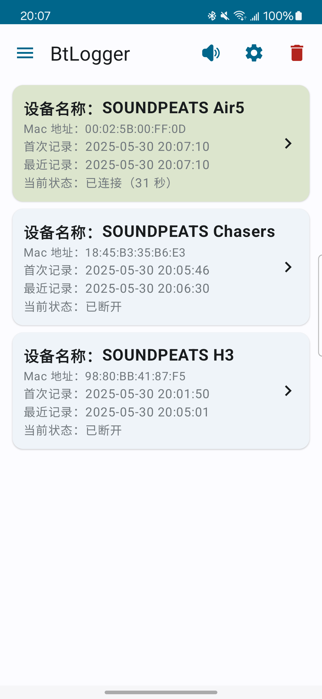
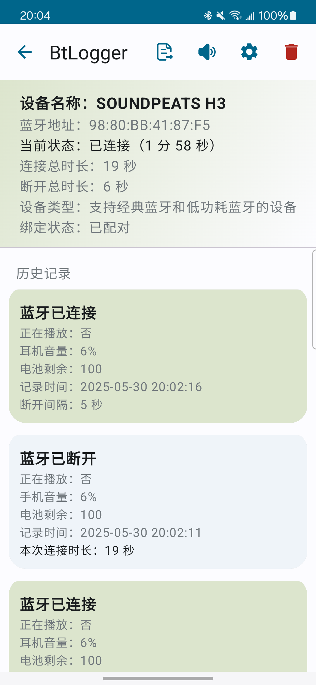
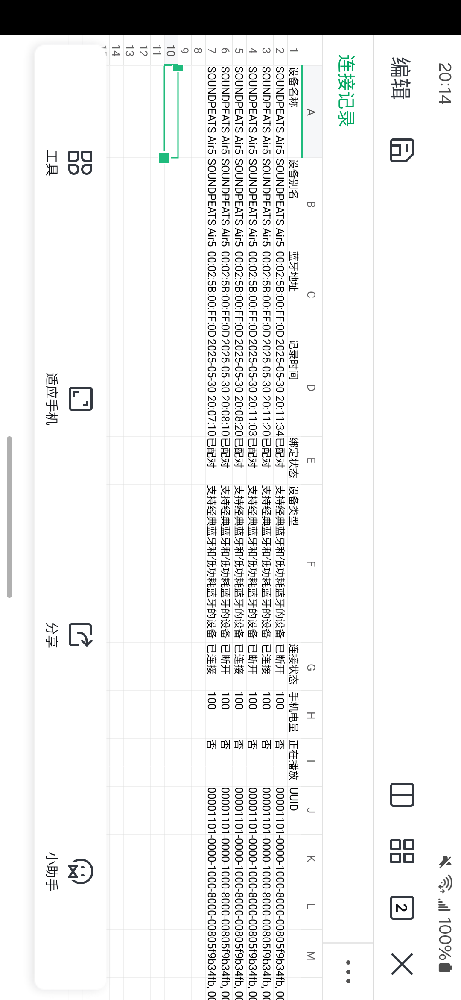
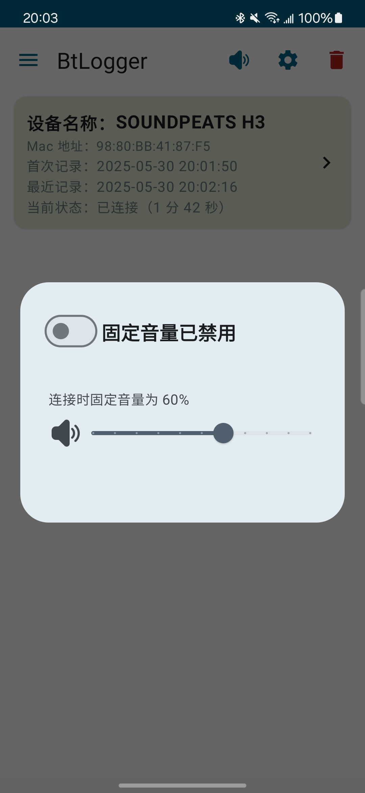
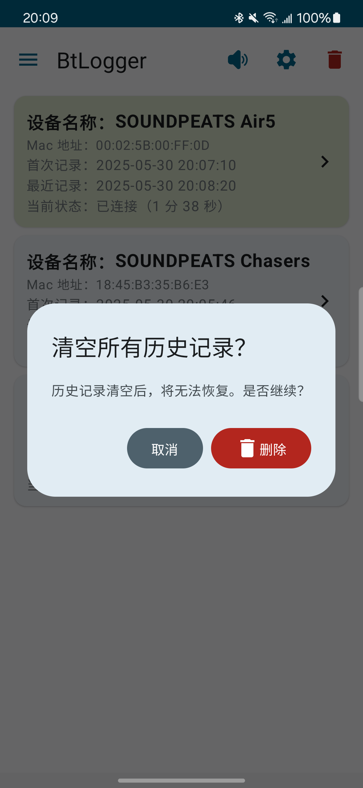
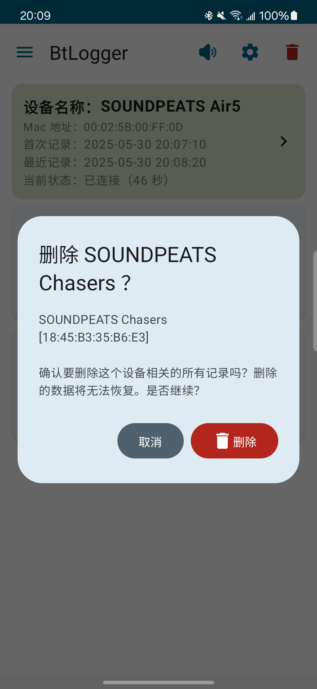
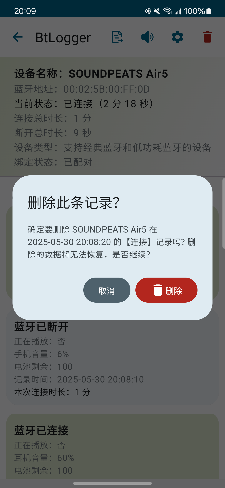

# BtLogger - 安卓蓝牙连接日志记录与分析工具

BtLogger 是一款面向测试与研发场景的 Android 应用，用于自动记录蓝牙音频设备的连接全链路信息。它不仅捕获连接/断开事件，还会主动探测耳机电量、蓝牙版本、音频编解码（Codec），并提供连接历史、趋势图表与 Excel 导出，帮助用户分析蓝牙设备的行为与稳定性。

当前版本：**v1.2.0**（数据库 schema v7）

## 目录

* [主要功能](#主要功能)
* [屏幕截图/界面概览](#屏幕截图界面概览)
* [技术栈与依赖库](#技术栈与依赖库)
* [项目结构](#项目结构)
* [核心实现逻辑](#核心实现逻辑)
    * [前台服务与蓝牙事件监听](#前台服务与蓝牙事件监听)
    * [耳机电量采集](#耳机电量采集)
    * [蓝牙版本探测](#蓝牙版本探测)
    * [音频 Codec 采集](#音频-codec-采集)
    * [数据存储与管理](#数据存储与管理)
    * [数据展示](#数据展示)
    * [数据导出](#数据导出)
    * [音量控制](#音量控制)
    * [应用更新](#应用更新)
* [权限说明](#权限说明)
* [如何构建](#如何构建)
* [CI/CD](#cicd)
* [使用说明](#使用说明)
* [已知问题与未来改进](#已知问题与未来改进)

## 主要功能

* **前台服务保活**：核心监听逻辑迁移至前台服务 `BtLoggerForegroundService`，即使 UI 被回收也能持续记录事件；通知栏常驻提示运行状态。
* **自动事件记录**：监听 A2DP 连接状态变化（`ACTION_CONNECTION_STATE_CHANGED`）、A2DP 编解码切换（`ACTION_CODEC_CONFIG_CHANGED`）、手机电量变化（`ACTION_BATTERY_CHANGED`），以及耳机电量广播与 HFP 厂商特定事件。
* **详细日志信息**：为每条事件记录以下字段
    * 事件类型：`CONNECTED` / `DISCONNECTED` / `CODEC_CHANGED` / `BATTERY_CHANGED`
    * 设备名称、MAC、alias、bondState、deviceType、UUIDs
    * 蓝牙版本（多源推断）
    * 音频 Codec（手机支持、当前可协商、当前激活）
    * 手机电量、耳机电量（0~100，-1 表示无法获取）
    * 媒体音量（百分比 + 原始 level/maxLevel）、蓝牙是否为当前音频输出、是否正在播放
    * 时间戳
* **耳机电量多通道采集**：
    * 反射读取 `BluetoothDevice.getBatteryLevel()` 系统缓存
    * 解析 `android.bluetooth.device.action.BATTERY_LEVEL_CHANGED` 隐藏广播
    * 解析 HFP 厂商事件 `+XEVENT` / `+IPHONEACCEV`（Vendor Specific Headset Event）
    * 针对 LE/双模设备通过 GATT 订阅标准 Battery Service（`0x180F` / `0x2A19`）
    * 多源合并去重，并对当前连接记录进行回填
* **蓝牙版本探测**：
    * 通过 `BluetoothClass`、`BluetoothAdapter.isLeXxxSupported()` 等公开 API 做特征推断
    * 对 LE/双模设备额外 GATT 读取 Device Information Service，抓取厂商在特征值里明文上报的 `Bluetooth 5.x` 等字样
    * 支持 BLE 广播扫描（Advertisement Probe）辅助识别
    * 多源结果合并（`BluetoothVersionUtils.mergeBluetoothVersion`），只取信息量更高的值
* **设备列表总览**：
    * 列表形式展示所有历史设备，显示首次/末次记录时间、当前连接状态
    * 连接中设备以绿色背景高亮
    * 点击进入详情，长按可删除整个设备及其记录
* **设备详情**：
    * 展示设备元信息（名称、MAC、类型、bondState、蓝牙版本、UUIDs、最新 Codec 快照）
    * 总连接时长 / 总断开时长统计
    * 按时间倒序的事件列表，显示事件类型徽章、Codec、音量、手机电量、耳机电量、播放状态与时间间隔
    * **电量趋势图表**：基于 Vico 2.0 绘制，展示耳机电量随时间的变化
    * 长按记录可删除单条记录
* **数据持久化**：Room 数据库（version 7）本地存储设备表与连接记录表；跨版本升级采用 `fallbackToDestructiveMigration`。
* **Excel 数据导出**：通过 jxl 库导出指定设备的完整历史为 `.xls` 文件，并通过 `FileProvider` 提供系统分享入口。
* **固定音量功能**：开启开关并设定百分比后，当蓝牙设备连接时自动将媒体音量调整到预设值；内部使用 `AudioManager` + `ContentObserver` + `AudioDeviceCallback` 监听音量变化并实时回显。
* **应用内更新**：集成蒲公英 SDK (`com.pgyer:analytics`)，支持版本检查、下载（RxDownload4）、安装。
* **Material 3 + Compose UI**：基于 Jetpack Compose 的现代化 UI，支持系统深色模式。
* **数据清理**：单条删除、按设备删除、全量清空，关键操作均有二次确认。

## 屏幕截图/界面概览





1. **主屏幕（设备列表）**
    * 顶部应用栏包含菜单（版本信息/检查更新）、音量预设、系统蓝牙设置跳转与全局清空按钮
    * 列表展示所有历史设备，连接中设备以高亮背景标记
    * 点击进入详情，长按弹出删除确认
2. **设备详情**
    * 顶部栏提供返回与 Excel 导出
    * 头部展示设备元信息、总连接/断开时长、Codec、蓝牙版本
    * 电量趋势图表展示耳机电量随时间变化
    * 事件列表按时间倒序显示每一条记录，含事件徽章（连接/断开/Codec/电量）
    * 长按列表项可删除单条记录
3. **对话框**
    * **音量预设**：开关控制是否启用固定音量，滑块设置目标百分比
    * **删除确认**：全量清空 / 按设备删除 / 单条删除
    * **版本更新**：有新版本时展示更新日志并提供立即更新/稍后
    * **下载进度**：实时展示下载进度（基于 RxDownload4 的真实进度）

## 技术栈与依赖库

| 类别 | 组件 |
|------|------|
| 语言 | Kotlin 2.0.21 |
| JVM | Java 17 |
| 构建 | Android Gradle Plugin 8.2.2, Gradle Version Catalogs |
| 编译配置 | compileSdk 36 / targetSdk 33 / minSdk 25 |
| UI | Jetpack Compose (BOM 2022.10.00), Material 3, Compose Compiler Plugin 2.0.21 |
| 架构 | MVVM + Repository + Hilt 依赖注入 |
| 异步 | Kotlin Coroutines + Flow（`Dispatchers.IO`），LiveData |
| 数据库 | Room 2.5.0（KSP 注解处理） |
| 依赖注入 | Hilt 2.48（kapt） |
| 事件总线 | GreenRobot EventBus 3.3.1 |
| 图表 | Vico `compose-m3` 2.0.0-beta.1 |
| 工具库 | `com.blankj:utilcodex` 1.31.0 |
| Excel 导出 | `jxl.jar`（本地依赖） |
| 应用分发 | 蒲公英 `com.pgyer:analytics` 4.3.3 + RxDownload4 1.1.4 |

## 项目结构

```
com.xingkeqi.btlogger
├── BtLoggerApplication.kt        # Application 入口，创建前台服务通知通道 + 初始化蒲公英 SDK
├── MainActivity.kt               # Compose UI 入口（设备列表、详情、对话框）
├── MainViewModel.kt              # UI 状态与数据订阅（LiveData/Flow）
├── data/                         # 数据层
│   ├── BtLoggerDatabase.kt       # Room 数据库（version 7，destructive migration）
│   ├── BtLoggerDao.kt            # DeviceDao / RecordDao / DeviceWithRecordsDao
│   ├── BtLogggerEntity.kt        # Device / DeviceConnectionRecord / DeviceInfo / RecordInfo / RecordEventType
│   ├── MessageEvent.kt           # EventBus 事件类
│   └── repo/                     # Repository 层（BtLoggerRepository / MainRepository）
├── di/
│   └── DatabaseModule.kt         # Hilt Module，提供 Database 与 DAO
├── receiver/
│   └── BtLoggerRecevier.kt       # 兼容保留的静态 Receiver（Android 8.0+ 隐式广播已失效）
├── service/                      # 核心运行时
│   ├── BtLoggerForegroundService.kt         # 前台服务，承载所有广播监听与落库逻辑
│   ├── BluetoothCodecUtils.kt               # A2DP Codec 解析（CodecSnapshot + Formatter）
│   ├── BluetoothBatteryProbeManager.kt      # 反射 + GATT 订阅耳机电量
│   ├── BluetoothVersionProbeManager.kt      # 通过 DIS GATT 读取蓝牙版本
│   └── BluetoothVersionAdvertisementProbeManager.kt  # BLE 广播扫描辅助识别版本
├── ui/
│   ├── AppComponent.kt           # 通用 Composable 组件
│   ├── components/               # 业务组件
│   │   ├── BatteryIndicator.kt   # 手机/耳机电量指示器
│   │   ├── BatteryTrendChart.kt  # Vico 耳机电量趋势图
│   │   ├── ConnectionStatusIndicator.kt
│   │   ├── DurationProgressBar.kt
│   │   ├── SignalStrengthIndicator.kt
│   │   ├── StatCard.kt
│   │   └── StatusBadge.kt
│   ├── slider/SliderScreen.kt    # 示例/备用屏
│   └── theme/                    # Color / Dimens / Theme / Type
└── utils/
    ├── BluetoothBatteryUtils.kt  # 耳机电量广播 + HFP 厂商事件解析
    ├── BluetoothVersionUtils.kt  # 蓝牙版本推断与合并
    ├── JxlUtils.kt               # Excel 导出
    ├── MediaVolumeUtils.kt       # 媒体音量快照与路由信息
    └── SimpleUtils.kt            # 时间格式化等
```

关键 Manifest 配置（`app/src/main/AndroidManifest.xml`）：
* `BtLoggerForegroundService`：`foregroundServiceType="connectedDevice"`
* `BtLoggerReceiver`：保留静态注册，实际主要依赖前台服务动态注册
* `FileProvider`：authorities=`${applicationId}.fileProvider`，路径配置在 `res/xml/excel_file_paths.xml`

## 核心实现逻辑

### 前台服务与蓝牙事件监听

* 应用启动后通过 `BtLoggerForegroundService.start(context)` 启动前台服务，`startForegroundService` 搭配 `NotificationChannel`（low importance）展示常驻通知。
* 前台服务在 `onCreate` 时动态注册 `BroadcastReceiver`，监听以下 Action：
    * `BluetoothA2dp.ACTION_CONNECTION_STATE_CHANGED`
    * `android.bluetooth.a2dp.profile.action.CODEC_CONFIG_CHANGED`（API 28+）
    * `Intent.ACTION_BATTERY_CHANGED`
    * `android.bluetooth.device.action.BATTERY_LEVEL_CHANGED`（隐藏 API）
    * `BluetoothHeadset.ACTION_VENDOR_SPECIFIC_HEADSET_EVENT`
* 所有落库操作通过 `serviceScope`（`SupervisorJob + Dispatchers.IO`）异步执行；对同一设备的 codec/battery 快照使用 `Mutex` 保护并发。
* 落库成功后通过 EventBus 发送 `MessageEvent("ADD_RECORD", device, record)` 通知 UI。
* 静态 `BtLoggerReceiver` 仅保留兼容入口，Android 8.0+ 对隐式广播的限制已使其在大多数场景失效。

### 耳机电量采集

耳机电量没有稳定的公开 SDK API，`BluetoothBatteryProbeManager` 与 `BluetoothBatteryUtils` 协同做多通道采集：

1. **系统广播**：`ACTION_BATTERY_LEVEL_CHANGED` 携带 `android.bluetooth.device.extra.BATTERY_LEVEL`。
2. **HFP 厂商事件**：解析 `+XEVENT ... BATTERY,current,max` 与 Apple `+IPHONEACCEV` 电量指示（1 号子命令）。
3. **反射回退**：在连接瞬间反射 `BluetoothDevice.getBatteryLevel()` 读取系统缓存值。
4. **GATT 订阅**：对 LE / DUAL 设备建立 GATT 连接，读取 Battery Service `0x180F` 的 `0x2A19` 特征，并订阅 CCCD 通知。
5. **去重与回填**：`latestHeadsetBatteryLevels` 缓存 + `latestPersistedBatterySnapshots` 做去重；当前连接中的最新 `CONNECTED` 事件会被回填最新耳机电量，避免详情页首行缺失数据。

### 蓝牙版本探测

`BluetoothVersionUtils` + `BluetoothVersionProbeManager` + `BluetoothVersionAdvertisementProbeManager` 组合：

* 首先通过公开 API（`BluetoothClass`、`BluetoothAdapter.isLeXxxSupported` 等）做粗粒度推断。
* 对 LE/双模设备进行 GATT 连接并读取 Device Information Service，从型号/固件/硬件特征值中识别明文 `Bluetooth 5.x` 字样。
* 可选的 BLE 广播扫描解析 AD Type，补齐广播端信息。
* 多源结果通过 `mergeBluetoothVersion` 合并，保留信息量更高的值（例如把 `Bluetooth 5` 升级为 `Bluetooth 5.2`）。
* 已持久化的版本会跳过重复探测，避免无谓 GATT 连接。

### 音频 Codec 采集

* 监听 `ACTION_CODEC_CONFIG_CHANGED`（API 28+），解析 `BluetoothCodecStatus` / `BluetoothCodecConfig`，得到 `phoneSupportedCodecs` / `negotiableCodecs` / `activeCodec`。
* `BluetoothCodecFormatter` 负责归一化（排序、去重），并区分两种落库策略：
    * **刷新快照**：Codec 列表变化但 activeCodec 未变 —— 只更新设备最新缓存 + 回填当前 `CONNECTED` 记录。
    * **写历史事件**：`activeCodec` 真正切换时写一条 `CODEC_CHANGED` 事件。
* 首次连接时若没有 codec 信息会同步落 `CODEC_UNKNOWN`，并在后续 codec 广播到达后回填。

### 数据存储与管理

* 数据库 `bt_logger_database`，当前 version = **7**；不兼容迁移时采用 `fallbackToDestructiveMigration()` 重建。
* 表结构：
    * `devices`（主键 MAC）：name / bondState / rssi / alias / deviceType / bluetoothVersion / uuids / latestPhoneSupportedCodecs / latestNegotiableCodecs / latestActiveCodec / latestCodecUpdatedAt
    * `device_connection_records`（自增 ID，外键级联删除）：deviceMac / timestamp / connectState / batteryLevel / headsetBatteryLevel / volume / isPlaying / eventType / phoneSupportedCodecs / negotiableCodecs / activeCodec
* DAO 层提供事务保护的 `DeviceWithRecordsDao.deleteDeviceWithRecords()`，确保设备与其记录一致性。
* `DeviceDao.getDeviceInfosWithConnectionRecords()` 使用 JOIN + 子查询一次性聚合每个设备的首末记录时间与最新连接状态。

### 数据展示

* `MainViewModel` 把 `DeviceDao` 与 `RecordDao` 的 Flow 转为 LiveData 供 Compose 观察。
* `recordInfoList` 在 `switchMap` 中按时间升序遍历，累计连接/断开时长并写回 `RecordInfo.totalConnectionTime`，UI 反转为倒序展示。
* `CODEC_CHANGED` / `BATTERY_CHANGED` 事件不计入连接/断开时长的累计（`isStateEvent` 过滤）。

### 数据导出

* 在设备详情点击导出按钮 → `JxlUtils.saveDataToSheet()` 使用 jxl 生成 `.xls`。
* 文件保存在应用内部存储，通过 `FileProvider`（authorities = `${applicationId}.fileProvider`，配置在 `res/xml/excel_file_paths.xml`）以 content URI 共享，通过 `Intent.ACTION_VIEW` 打开。

### 音量控制

* 顶部栏音量按钮打开预设对话框，开关 `customVolumeSwitch` + 滑块 `presetTestVolume` 设定目标百分比。
* 连接事件到达时若开关启用，使用 `AudioManager` 将 `STREAM_MUSIC` 设置到目标百分比。
* `MediaVolumeUtils.readMediaVolumeSnapshot()` 统一读取当前音量（percent、current level、max level、是否有蓝牙音频输出、是否正在播放音乐），并通过 `ContentObserver`（监听 `Settings.System.VOLUME_SETTINGS`）+ `AudioDeviceCallback` 实时同步 UI。

### 应用更新

* 蒲公英 SDK 在 `Application.attachBaseContext` 中初始化，启用 `APP_LAUNCH_TIME` / `APP_PAGE_CATON` / `CHECK_UPDATE`。
* `MainViewModel.checkUpdate()` 调用 `PgyerSDKManager.checkSoftwareUpdate`；有新版本时通过 `showDialogLD` 驱动对话框。
* 下载使用 RxDownload4，`downloadProgressLD` 推送真实下载进度；完成后调用 `AppUtils.installApp(file)` 安装。

## 权限说明

```xml
<!-- 蓝牙 -->
<uses-permission android:name="android.permission.BLUETOOTH" />
<uses-permission android:name="android.permission.BLUETOOTH_ADMIN" />
<uses-permission android:name="android.permission.BLUETOOTH_CONNECT" />
<uses-permission android:name="android.permission.BLUETOOTH_SCAN" android:usesPermissionFlags="neverForLocation" />

<!-- 前台服务 -->
<uses-permission android:name="android.permission.FOREGROUND_SERVICE" />
<uses-permission android:name="android.permission.FOREGROUND_SERVICE_CONNECTED_DEVICE" />

<!-- 运行时与后台 -->
<uses-permission android:name="android.permission.RECEIVE_BOOT_COMPLETED" />
<uses-permission android:name="android.permission.WAKE_LOCK" />
<uses-permission android:name="android.permission.VIBRATE" />
<uses-permission android:name="android.permission.WRITE_SETTINGS" tools:ignore="ProtectedPermissions" />

<!-- 存储（Android 12 及以下用于外部共享） -->
<uses-permission android:name="android.permission.READ_EXTERNAL_STORAGE" android:maxSdkVersion="32" />
<uses-permission android:name="android.permission.WRITE_EXTERNAL_STORAGE" android:maxSdkVersion="32" />

<!-- 蒲公英 SDK -->
<uses-permission android:name="android.permission.ACCESS_NETWORK_STATE" />
<uses-permission android:name="android.permission.INTERNET" />
<uses-permission android:name="android.permission.READ_PHONE_STATE" />
<uses-permission android:name="android.permission.ACCESS_WIFI_STATE" />
<uses-permission android:name="android.permission.REQUEST_INSTALL_PACKAGES" />
```

关键点：
* **Android 12+**：`BLUETOOTH_CONNECT`、`BLUETOOTH_SCAN` 为运行时权限，应用启动时会请求；`BLUETOOTH_SCAN` 使用 `neverForLocation` 声明，避免触发位置权限提示。
* **前台服务**：`FOREGROUND_SERVICE_CONNECTED_DEVICE`（Android 14+ 必需）配合 manifest 的 `foregroundServiceType="connectedDevice"`。
* **隐私敏感**：`WRITE_SETTINGS` 当前未被实际使用，但仍保留在 manifest。

## 如何构建

```bash
# Debug APK
./gradlew assembleDebug

# Release APK（未配置签名时输出 app-release-unsigned.apk）
./gradlew assembleRelease

# 清理
./gradlew clean

# 单元测试
./gradlew test

# 仪器测试
./gradlew connectedAndroidTest
```

* APK 输出路径：`app/build/outputs/apk/`，命名模板为 `BtLogger-{variant}-v{versionName}-{versionCode}({applicationId}).apk`。
* `versionCode` 在 `app/build.gradle` 中按时间戳自动生成（每 10 秒 +1，可用到 ~680 年后）。
* Java/Kotlin 目标 JVM = 17，确保本地 JDK ≥ 17。
* 蒲公英 API Key 已写入 `AndroidManifest.xml` 的 `PGYER_API_KEY` meta-data。

## CI/CD

仓库已配置 GitHub Actions 工作流 `.github/workflows/release.yml`：

* **触发条件**：推送 `v*.*.*` 格式 tag，或 workflow_dispatch 手动触发
* **执行内容**：
    1. JDK 17 + Android SDK 环境准备
    2. Gradle 缓存
    3. 构建 Debug + Release APK
    4. 可选签名（依赖仓库 Secrets `KEYSTORE_FILE` / `KEYSTORE_PASSWORD` / `KEY_PASSWORD` / `KEY_ALIAS`）
    5. 基于上一个 tag 的 `git log` 自动生成 Changelog
    6. 创建 GitHub Release，上传 Debug/Release APK 到 Release 资产与 Artifacts

## 使用说明

1. **首次启动与权限**
    * Android 12+ 会请求 `BLUETOOTH_CONNECT` / `BLUETOOTH_SCAN`，请授予以便应用正常工作。
    * 通知栏会出现「蓝牙日志记录中」常驻通知，表示前台服务已启动。
2. **自动记录**
    * 应用在后台持续监听蓝牙事件，无需额外操作；建议保持前台或允许后台运行以避免被个别国产 ROM 杀死。
3. **查看设备列表**：主屏幕按历史记录顺序展示所有设备，绿色背景代表当前已连接。
4. **查看详细记录**：点击设备卡片进入详情，可查看元信息、总时长、电量趋势图、事件列表。
5. **导出 Excel 日志**：详情页右上角导出按钮生成 `.xls` 并尝试调用系统默认应用打开。
6. **固定音量**：主屏幕顶部音量按钮 → 启用开关 → 拖动滑块设定百分比；后续每次连接都会把媒体音量恢复到该值。
7. **检查更新**：顶部菜单按钮中触发；或等待蒲公英 SDK 被动检测。
8. **数据清理**
    * **全部**：顶部清空按钮
    * **某设备**：列表项长按
    * **单条记录**：详情页列表项长按
9. **快捷入口**：顶部蓝牙图标可跳转至系统蓝牙设置页。

## 已知问题与未来改进

* **部分厂商不上报耳机电量**：如果设备既不支持标准 BAS GATT Service，也不发送 `+XEVENT` / `+IPHONEACCEV`，则耳机电量会持续显示为「未知」（-1）。
* **蓝牙版本推断存在信息差**：公开 SDK 无法精确读取远端 Core Version，只能通过 DIS / 广播内容做启发式推断，极少数机型可能依然显示为「未知」。
* **前台服务保活**：个别国产 ROM（小米、OPPO、vivo 等）会在内存紧张时回收前台服务，必要时需手动加入「电池优化白名单」或「自启动/后台允许」。
* **数据库升级策略**：当前使用 `fallbackToDestructiveMigration`，schema 变更会清空历史数据；未来需要迁移到真正的 `Migration` 以保留用户数据。
* **开机自启**：已声明 `RECEIVE_BOOT_COMPLETED` 但尚未注册 `BOOT_COMPLETED` 监听；如需启动即录制需补齐该能力。
* **模块化拆分**：`MainActivity.kt` 目前承载了所有 Compose UI（约 1500+ 行），后续可按 Feature 拆包，并把 `MainViewModel` 的直接 DAO 依赖替换为现有 Repository。
* **统计维度**：可以基于事件数据增加更丰富的统计（日/周维度连接频率、平均连接时长、Codec 命中率等）。
* **过滤与排序**：设备列表与记录列表暂无过滤、搜索、排序能力，规模大时查找不便。
