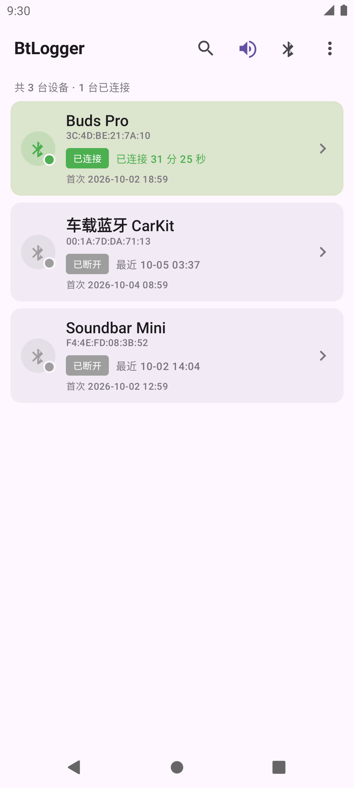
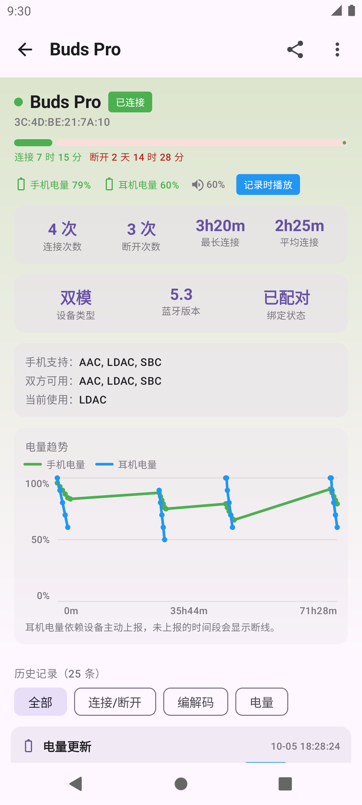
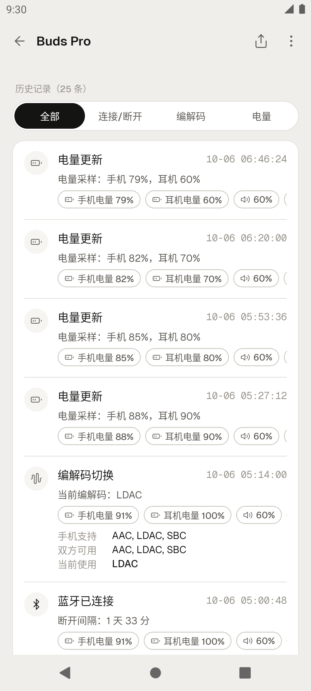
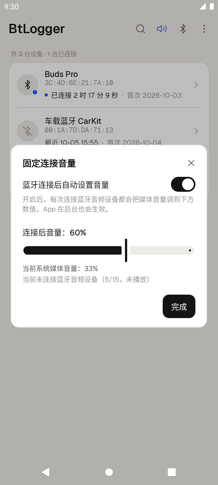
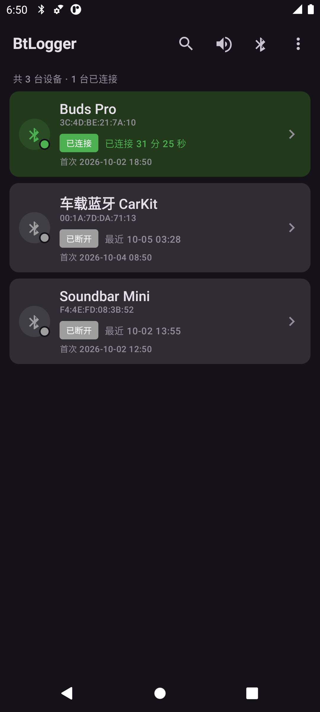
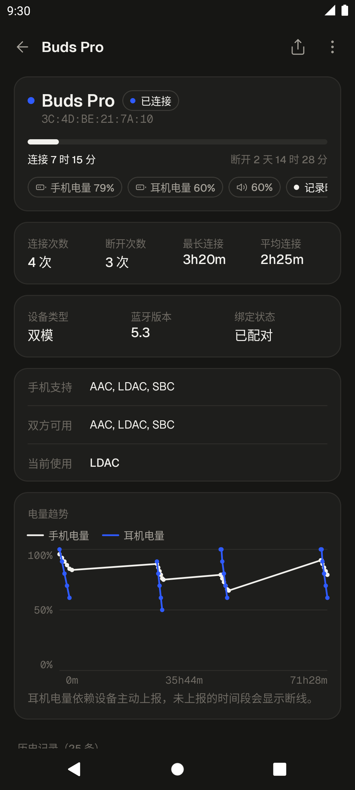
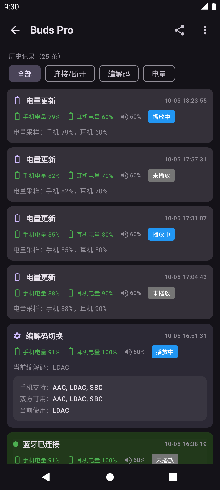
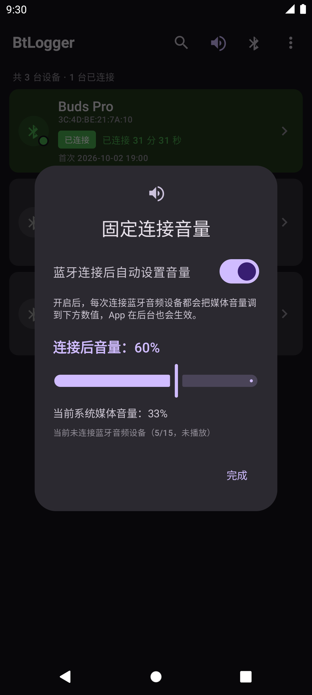

# BtLogger

> Android 蓝牙音频设备连接日志记录与分析工具
> A Bluetooth audio connection logger & analyzer for Android.

[](https://github.com/kekemao00/android-bt-logger/actions/workflows/ci.yml)
[](https://github.com/kekemao00/android-bt-logger/releases/latest)


[](LICENSE)

BtLogger 在后台持续记录蓝牙耳机、音箱、车机等 A2DP 设备的**连接 / 断开、编解码切换、手机与耳机电量、媒体音量、播放状态**，并按设备聚合展示、统计与导出。它面向蓝牙音频研发、测试与客诉复盘，把“偶现断连”“电量不准”“Codec 不对”这类难以复现的问题变成可追溯的数据。

所有数据只保存在本机，不会上传。

<p align="center">
  
  
  
  
</p>
<p align="center"><sub>设备列表 · 设备详情 · 历史记录 · 固定连接音量（截图使用示例数据，详见<a href="#截图">截图</a>）</sub></p>

## 目录

- [适用场景](#适用场景)
- [下载](#下载)
- [功能](#功能)
- [使用](#使用)
- [常见问题](#常见问题)
- [权限与隐私](#权限与隐私)
- [构建](#构建) · [架构](#架构) · [CI / 发布](#ci--发布) · [截图](#截图)

## 适用场景

- **耳机 / 音箱研发与测试**：长时间挂机记录连接稳定性，统计断连次数与单次连接时长。
- **客诉复盘**：让用户安装后正常使用，导出 Excel 即可看到“什么时候断的、当时电量多少、用的什么 Codec”。
- **兼容性验证**：对比不同手机上可用 / 实际使用的编解码，以及耳机电量是否能正确上报。

## 下载

在 [Releases](https://github.com/kekemao00/android-bt-logger/releases/latest) 下载最新 APK。每个 Release 附带 `SHA256SUMS.txt` 用于校验。

## 功能

| 能力 | 说明 |
|------|------|
| 后台持续记录 | 前台服务监听 A2DP 连接状态；开机、应用更新后自动恢复；服务重建时自动同步已连接设备 |
| 事件类型 | 连接、断开、编解码切换、电量采样（手机电量或耳机电量变化时） |
| 每条记录字段 | 时间、手机电量、耳机电量、媒体音量、是否播放、手机支持 / 双方可用 / 当前使用的编解码、设备类型、蓝牙版本、绑定状态、UUID |
| 设备列表 | 按最近活动排序、实时显示已连接时长、按名称或 MAC 搜索、长按删除 |
| 设备详情 | 连接 / 断开时长占比、连接与断开次数、最长与平均单次连接时长、编解码快照、电量趋势图、可按类型筛选的历史记录 |
| 耳机电量 | 多通道采集：系统缓存（反射）、`BATTERY_LEVEL_CHANGED` 广播、HFP `+IPHONEACCEV` / `+XEVENT`、BLE Battery Service（0x180F）；后到的数据会回填当前连接记录 |
| 蓝牙版本 | 综合 Device Information Service、BLE 广播指纹与设备目录推断，只会用更可信的结果覆盖已有值 |
| 固定连接音量 | 每次连接蓝牙音频设备后自动把媒体音量调到设定值，App 在后台同样生效，设置重启后保留 |
| 导出 | 导出单个设备或全部设备为 `.xls`，通过系统分享面板发送到微信、邮件、网盘等 |
| 应用内更新 | 通过蒲公英检查新版本、下载并安装，可随时取消下载 |

## 使用

1. 安装并打开应用，授予“附近的设备”权限（Android 12+）；Android 13+ 建议同时允许通知，以便在通知栏看到记录状态。
2. 连接任意蓝牙音频设备，记录会自动开始。之后关闭 App 也会继续记录。
3. 在列表中点击设备查看详情；右上角分享按钮导出该设备记录，溢出菜单可导出全部或清空。
4. 首页的音量按钮可开启“固定连接音量”。

> 部分国产 ROM 会限制后台运行，请在系统设置里允许 BtLogger 自启动并关闭电池优化。

## 常见问题

**关掉 App 之后还会记录吗？**
会。记录由前台服务完成，通知栏常驻“蓝牙日志记录中”通知即表示服务在运行；开机和应用更新后也会自动恢复。若通知消失，多半是系统清理了后台，请按上面的提示放开自启动与电池优化。

**为什么耳机电量显示“耳机未上报”？**
耳机电量依赖耳机通过 HFP 指令、电量广播或 BLE Battery Service 主动上报，部分耳机或手机组合不提供这些信息。只要任一通道后续拿到数据，就会回填到当前连接记录。

**编解码显示“不可用”或“未知”？**
Android 8.0 以上才提供 Codec 信息，且各厂商实现差异较大；有的系统只在开始播放后才完成协商。播放一段音频后通常会出现编解码切换记录。

**导出的 Excel 在哪里？**
导出后会直接弹出系统分享面板，可以发送到微信、邮件或保存到网盘；文件同时保存在应用私有目录，卸载应用会一并删除。

**卸载或升级会丢数据吗？**
卸载会清空数据。升级时如果数据库结构有变更，当前版本会重建数据库，建议升级前先导出全部记录。

## 权限与隐私

不需要账号，也没有统计或上报：记录只写入本机数据库，只有你主动导出时才会离开手机。网络权限仅用于检查更新。

| 权限 | 用途 |
|------|------|
| `BLUETOOTH_CONNECT`（12+） | 读取设备名称、连接状态与编解码 |
| `BLUETOOTH_SCAN`（12+，`neverForLocation`） | 读取 BLE 广播辅助推断蓝牙版本，拒绝不影响基础记录 |
| `BLUETOOTH` / `BLUETOOTH_ADMIN`（11 及以下） | 同上 |
| `POST_NOTIFICATIONS`（13+） | 显示前台服务通知 |
| `FOREGROUND_SERVICE` / `FOREGROUND_SERVICE_CONNECTED_DEVICE` | 后台持续监听 |
| `RECEIVE_BOOT_COMPLETED` | 开机自动恢复记录 |
| `INTERNET` 等 | 仅用于蒲公英更新检查 |

## 构建

环境：JDK 17、Android SDK（compileSdk 36）。

```bash
./gradlew testDebugUnitTest   # 单元测试
./gradlew assembleDebug       # 构建 debug APK
./gradlew assembleRelease     # 构建 release APK（未签名）
```

APK 输出到 `app/build/outputs/apk/{debug,release}/`，文件名形如 `BtLogger-release-v1.2.1-<versionCode>(com.xingkeqi.btlogger).apk`。

## 架构

```text
BtLoggerForegroundService ──(广播: A2DP / Codec / 电量)──▶ Room (devices, device_connection_records)
        │  探测器: BluetoothBatteryProbeManager / BluetoothVersion*ProbeManager                │
        │  固定音量: applyFixedMediaVolume                                                       │ Flow
        ▼                                                                                        ▼
   常驻通知（已连接设备）                         MainViewModel (StateFlow / 一次性 UiEvent)
                                                                │
                                         BtLoggerApp ─▶ DeviceListScreen / DeviceDetailScreen (无状态 Compose)
```

- **采集**全部在前台服务中完成，不依赖界面是否存活；每条链路都有防崩边界，探测失败只降级，不影响基础连接记录。
- **ViewModel** 暴露 `StateFlow`，页面组件无状态，事件通过回调上抛；Toast / 分享等一次性事件走 `Channel`。
- **统计**（累计时长、单次连接时长等）是纯函数 `buildRecordTimeline` / `computeRecordStats`，有单元测试覆盖。
- **设置**保存在 `AppSettings`（SharedPreferences + StateFlow），前台服务与界面共享。

主要目录：

```text
app/src/main/java/com/xingkeqi/btlogger/
├── MainActivity.kt / MainViewModel.kt
├── data/       Room 实体、DAO、记录时间线统计
├── service/    前台服务、编解码解析、电量与蓝牙版本探测
├── receiver/   开机自启接收器
├── ui/         BtLoggerApp、screens/、dialogs/、components/、theme/
└── utils/      Excel 导出、音量、电量、蓝牙版本、设置
```

## CI / 发布

- **CI**（`.github/workflows/ci.yml`）：每次 push 到 `main` 和每个 PR 都会运行单元测试并构建 debug APK，产物可在 Actions 页面下载。
- **Screenshots**（`.github/workflows/screenshots.yml`）：在模拟器上重新生成 README 截图，见[截图](#截图)。
- **Release**（`.github/workflows/release.yml`）：推送 `v*.*.*` tag 即自动发布：

  ```bash
  git tag v1.3.0
  git push origin v1.3.0
  ```

  流水线会运行测试、以 tag 作为 `versionName` 构建、签名、按 Conventional Commits 分组生成更新日志，并上传 APK 与校验文件。也可以不在本地打 tag：在 Actions → Release → Run workflow 中填写新版本号（如 `v1.3.0`），流水线会基于 `main` 自动创建 tag 并发布。合并 PR 本身不会发布新版本。

  正式签名需要在仓库 Secrets 中配置 `KEYSTORE_FILE`（keystore 的 base64）、`KEYSTORE_PASSWORD`、`KEY_ALIAS`、`KEY_PASSWORD`。未配置时只发布 debug APK，不会让发布失败。

  ```bash
  base64 -w0 release.jks   # 生成 KEYSTORE_FILE 的值
  ```

## 截图

README 中的截图由 [Screenshots](.github/workflows/screenshots.yml) 工作流生成：在 Android 11 模拟器上写入三台示例设备的数据，启动真实应用并截取浅色与深色界面，结果提交到 [`docs/screenshots/`](docs/screenshots)。界面有较大改动时，在 Actions → Screenshots → Run workflow 选择分支即可重新生成。

截图逻辑在 [`ReadmeScreenshotTest`](app/src/androidTest/java/com/xingkeqi/btlogger/screenshots/ReadmeScreenshotTest.kt)。它会清空设备上的记录，所以只有传入 `-e readmeScreenshots true` 时才运行，普通的 `connectedAndroidTest` 会自动跳过。

<details>
<summary>深色模式</summary>
<p align="center">
  
  
  
  
</p>
</details>

## 已知限制

- 耳机电量、完整 Codec 信息依赖手机系统与耳机实现，部分组合无法获取。
- 蓝牙版本为多源推断结果，不保证 100% 准确。
- 数据库升级使用破坏性迁移，大版本升级前请先导出数据。

## 参与贡献

提交信息遵循 [Conventional Commits](https://www.conventionalcommits.org/zh-hans/)（`feat:`、`fix:`、`refactor:` 等），发布说明会据此自动分组。提交 PR 前请确保 `./gradlew testDebugUnitTest assembleDebug` 通过。

## License

[Apache License 2.0](LICENSE)
